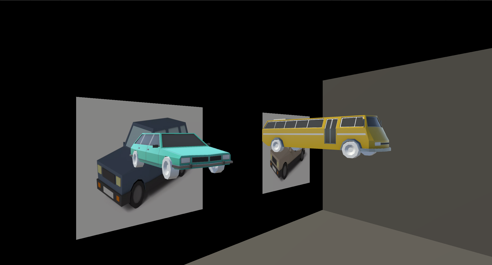

<h1 align="center">Projeto de Realidade Aumentada – Livro Infantil com Realidade Aumentada</h1>

<p align="center">
  Aplicação interativa em <strong>Realidade Aumentada (AR)</strong> desenvolvida no <strong>Unity</strong>, 
  permitindo visualizar e interagir com modelos 3D de veículos voltada ao público infantil.
</p>

---

<h2 align="center">📸 Visualização do Projeto</h2>

<div align="center">
    <div style="display: flex; justify-content: space-around; gap: 20px;">
        
        
    </div>
</div>

---

## 🧩 Descrição do Projeto  
Este projeto apresenta uma aplicação de **Realidade Aumentada (AR)** desenvolvida no **Unity**, voltada para o **público infantil**, que permite **visualizar e interagir com modelos 3D de veículos** de forma lúdica e educativa.  
Através da câmera do dispositivo, as crianças podem explorar diferentes tipos de veículos como carros e ônibus, que ganham vida quando um marcador de imagem é reconhecido, promovendo **aprendizado interativo** e **imersão visual**.  

---

## Funcionalidades Implementadas  
- Exibição de modelos 3D de veículos em Realidade Aumentada.  
- Interação com os modelos (toque, telas explicativas).  
- Interface intuitiva voltada para o público infantil.  
- Reconhecimento de imagem para ativar os modelos 3D.  
- Efeitos sonoros e visuais que tornam a experiência mais imersiva.  

---

## 🛠️ Tecnologias e Dependências  

### Ferramentas Principais  
- **Unity** (recomendado: 2022.x ou superior)  
- **C#** – linguagem utilizada para scripts (ex: `ARTouch.cs`, `ImageTracker.cs`)  
- **AR Foundation (5.1.6)** – integração entre Unity e plataformas de AR  
- **ARCore (5.1.6)** – suporte à Realidade Aumentada em dispositivos Android  
- **TextMesh Pro (3.0.6)** – textos e interfaces com melhor qualidade visual  
- **Unity UI (UGUI)** – interface e interação com elementos visuais  

### Recursos do Projeto  
- **Pasta `Simple Vehicle Pack`** → modelos 3D de veículos utilizados  
- **Pasta `Sounds`** → efeitos sonoros aplicados aos modelos  
- **Pasta `Materials`** → texturas e materiais dos veículos  
- **Pasta `XR`** → componentes e configurações de Realidade Aumentada  
- **Scripts principais:**  
  - `ARTouch.cs` – controla a interação do usuário com os modelos 3D e as placas 
  - `ImageTracker.cs` – realiza o rastreamento e reconhecimento dos marcadores
---

## 📦 Configuração e Build  

### Requisitos  
- **Unity Hub** instalado  
- **Unity Editor 2022.3.40f1** 
- Dispositivo Android compatível com **ARCore**  

### Como Configurar  
1. Clone este repositório:  
   ```bash
   git clone https://github.com/MatheusAlatxeve/Projeto_AR.git
2. Abra o projeto no Unity Hub
3. Certifique-se de que os pacotes AR Foundation e ARCore XR Plugin estão instalados.
4. Adicione suas Image Targets e associe os modelos 3D correspondentes.
5. Configure a AR Camera como câmera principal.

### Integrantes
Matheus Alatxeve Pereira RA:20.00528-8
Eduardo Anjos Villela RA:22.00506-4
Gabriel Araujo Carrasco RA:22.00906-0
Gustavo Yudji Hiromoto RA:22.00839-0
``
